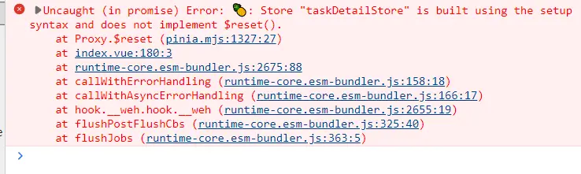

1. pinia本身提供了一个reset方法，可以重置store

```javascript
const store = useStore()

store.$reset()
```
但是store如果采用setup写法的时候，使用reset方法，因为不支持所以会报错，如下图：

解决方法：
2. 在mian.ts中为pinia注册reset方法，如下：

```javascript
pinia.use(({ store }) => {
  const initialState = JSON.parse(JSON.stringify(store.$state));
  store.$reset = () => {
    store.$patch(($state) => {
      Object.assign($state, JSON.parse(JSON.stringify(initialState)));
    });
  }
})
```
但是发现了一个问题，不太明白：
store中有如下两个变量：

```javascript
//store.ts
const obj1 = ref({
})
const obj2 = reactive({})
//页面中使用
const { obj1, obj2 } = storeToRefs(store)
```
页面中obj1可以被重置，obj2并没有被重置，但是在main.ts中打印其实重置过了的。
最后发现reactive不能直接赋值，否则会丢失响应式！！！