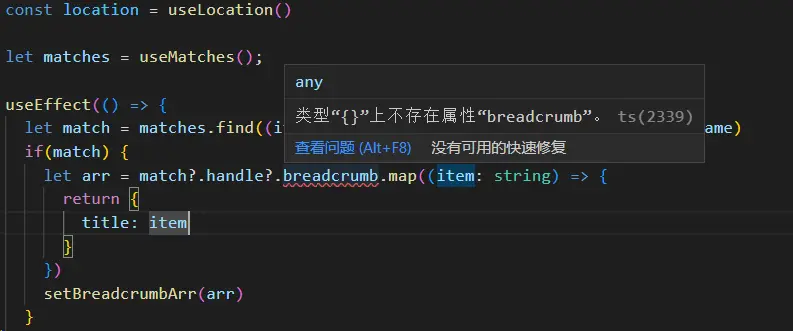

在使用`react-router-dom`的时候，用到了`useMatches`的方法，ts一直提示报错，如下：


根据提示，找到了这个类型：
```js
export interface UIMatch<Data = unknown, Handle = unknown> {
    id: string;
    pathname: string;
    params: AgnosticRouteMatch["params"];
    data: Data;
    handle: Handle;
}
import type {UIMatch} from "react-router-dom"
```
这才对泛型有了一丢丢理解。
使用时的场景：

```js
const location = useLocation()
  let matches = useMatches();
  useEffect(() => {
    let match = matches.find((item: any) => item.pathname == location.pathname)
    if(match) {
      let arr = match?.handle?.breadcrumb.map((item: string) => {
        return {
          title: item
        }
      })
      
    }
  }, [location.pathname])
```

`breadcrumb`一直提示报错
发现`matches`的数据类型为`UIMatch<unknown, unknown>`所以报错

根据`UIMatch`的类型提示，我们发现`Data`和`Handle`的类型为`unknown`，所以这时候需要使用`any`进行强制类型转换, 代码如下：

`let matches = useMatches() as any;`
``
或者将`matches`的类型声明：
`let matches:UIMatch<any, any>[] = useMatches()`

**注意的是：`unknown`只能接受`any`或者`unknown`类型。**


接下来展示两个示例：
+ 示例一


```javascript
interface IParams<D = number, M = string> {
  data: D,
  m: M
}
function getPrams(path: IParams<number,string>):IParams<number, string> {
  console.log(path)
  return {
    data: 2,
    m: '3'
  }
}
const params = getPrams({
  data: 4,
  m: '6'
})
```
+ 示例二

```javascript
function test <T> (arg:T):T{
  console.log(arg);
  return arg;
}
test<number>(111);// 返回值是number类型的 111
test<string | boolean>('hahaha')//返回值是string类型的 hahaha
test<string | boolean>(true);//返回值是布尔类型的 true
```

[参考文章](https://blog.csdn.net/weixin_44761091/article/details/124017662)


