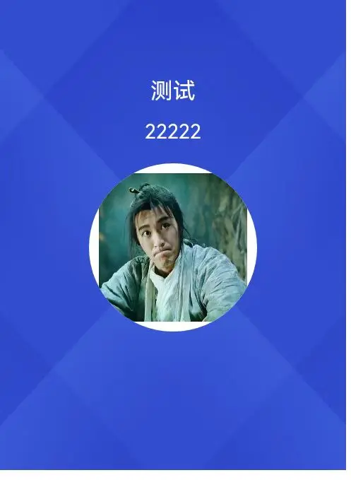

需求，uniapp微信小程序将页面某一部分保存为图片可以分享，下载。实现这一功能需要使用canvas绘图，背景图为网络图片，中间有个原型的二维码，图片格式为base64，还有一些其他的文字。
最重要的是：无论是网络图片还是base64格式的，拿到一个临时地址！！！base64方法参考[此文章](https://blog.csdn.net/weixin_38009285/article/details/106501817)
注：base64可以直接canvas绘制，但是真机不显示！！！模拟器正常！

```js
//绘制canvas 
<canvas style="width: 280px;height:380px" canvas-id="activityCode" ></canvas>
//下面两个方法是将base64图片转换成临时地址
function removeSave(FILE_BASE_NAME = 'tmp_base64src', format = 'jpg') {
	return new Promise((resolve) => {
		// 把文件删除后再写进，防止超过最大范围而无法写入
		const fsm = uni.getFileSystemManager(); //文件管理器
		const FILE_BASE_NAME = 'tmp_base64src';
		const filePath = `${wx.env.USER_DATA_PATH}/${FILE_BASE_NAME}.${format}`;
		fsm.unlink({
			filePath: filePath,
			success(res) {
				console.log('文件删除成功');
				resolve(true);
			},
			fail(e) {
				console.log('readdir文件删除失败：', e);
				resolve(true);
			}
		});
	})
}
function base64ToSave(base64data: any, FILE_BASE_NAME = 'tmp_base64src') {
	const fsm = uni.getFileSystemManager();
	return new Promise(async (resolve, reject) => {
		//format这个跟base64数据的开头对应
		const [, format, bodyData] = /data:image\/(\w+);base64,(.*)/.exec(base64data) || [];
		if (!format) {
			reject(new Error('ERROR_BASE64SRC_PARSE'));
		}
        await removeSave(FILE_BASE_NAME, format);
		const filePath = `${wx.env.USER_DATA_PATH}/${FILE_BASE_NAME}.${format}`;
		//const buffer = wx.base64ToArrayBuffer(bodyData);
		fsm.writeFile({
			filePath,
			data: bodyData,
			//data: base64data.split(";base64,")[1],
			encoding: 'base64',
			success() {
				resolve(filePath);
			},
			fail() {
				reject(new Error('ERROR_BASE64SRC_WRITE'));
			},
		});
	});
}

```

```js
//开始绘制
//1.背景网络图片

function drawCanvas() {
    const ctx = uni.createCanvasContext('activityCode')
    uni.getImageInfo({
        src: '****',
        success:res=>{
  			//背景图
            ctx.drawImage(res.path, 0, 0, 140, 190);   //插入图片
			//绘制文案
            ctx.setFontSize(9)
            ctx.fillStyle='#FFFFFF'
            ctx.setTextAlign('center')
            ctx.fillText('***', 70, 40)

			//绘制一个原型的图片
            circleImg(ctx)
            ctx.draw()

        },
        fail:res=>{
            console.log(`缓存失败：${res.errMsg}`);    
        }
    })
    
}
//2.绘制圆形图片
function circleImg(ctx) {
    ctx.beginPath()
    ctx.arc(70, 100, 34, 0, 2 * Math.PI)
    ctx.setFillStyle('#ffffff')
    ctx.fill()
    ctx.clip()
	//url就是上方保存的base64临时地址
    ctx.drawImage(url, 40, 70, 60, 60);
    
}
//保存图片
function saveImg() {
    uni.canvasToTempFilePath({
        canvasId: 'activityCode',
        success: function(res) {
            uni.saveImageToPhotosAlbum({
                filePath: res.tempFilePath,
                success: function () {
                    uni.showToast({
                        title: '保存成功',
                        icon: 'success'
                    })
                },
                fail: function () {
                    uni.showToast({
                        title: '保存失败',
                        icon: 'none'
                    })
                }
            })
        } 
    })
}
```

注：保存图片的时候最好不要写尺寸，否则会影响生成图片的清晰度！
效果图：

