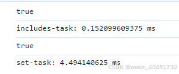

​
今天在看react文档的时候发现这样一段话：

所以就想尝试下，做了一个简单的demo：

```javascript
<!DOCTYPE html>
<html lang="en">
<head>
  <meta charset="UTF-8">
  <meta name="viewport" content="width=device-width, initial-scale=1.0">
  <title>Document</title>
</head>
<body>
  <script>
    let n = 10000000
    let arr = new Array(n)
    for(let i = 0; i < n;i++) {
      arr[i] = i+1
    }
    console.time("includes-task");
    console.log(arr.includes(n))
    console.timeEnd("includes-task"); 

    const ids = new Set(arr)
    console.time("set-task");
    console.log(ids.has(n))
    console.timeEnd("set-task"); 

  </script>
</body>
</html>
```
运行结果如下：
结果确实如官网所说：随着`n`的增大，时间差距越明细，`Set has`的性能更好。

但是上面的情况其实忽略了`new Set`这样一个过程，经过代码测试，发现这个过程极其耗费时间！我们可以修改一下代码如下：

```javascript
 console.time("set-task");
 constids = new Set(arr)
 console.log(ids.has(n))
 console.timeEnd("set-task"); 
```
运行结果如下：

反而这个时候`includes`方法更好一些，这个时候就比较疑惑`React`官网的介绍了。。。
另外还有一种极限情况，就是`n`过于大，会导致`Set`方法内存溢出。。。
希望有大佬可以帮忙解释一下`React`官网那种适用于什么情况，感谢！！！
