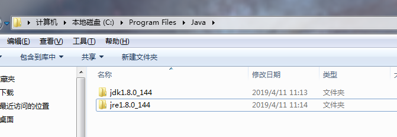
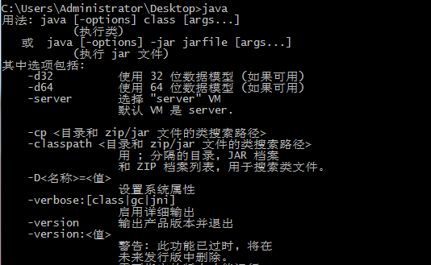
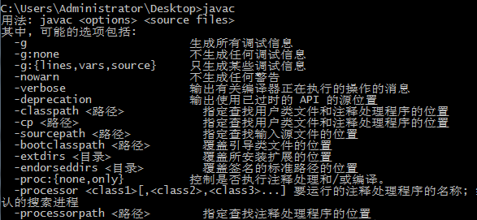

- 安装jdk（最好装在C盘）

  - 安装结果展示

    ​		

    

  - 配置环境变量 

    - JAVA_HOME，JDK的安装路径
    - CLASSPATH，.;%JAVA_HOME%\lib;%JAVA_HOME%\lib\tools.jar
    - PATH，%JAVA_HOME%\bin;%JAVA_HOME%\jre\bin;
    - JRE_HOME，JRE的安装路径

  - 监测是否安装成功

    1.cmd输入java：

  ​		
  ​	
    2.cmd输入javac：

  ​		

  

    

    

    

  

- 安装tomcat路径

  - 配置环境变量 

    - CATALINA_BASE，tomcat的安装路径
    - CATALINA_HOME，tomcat的安装路径

  - 修改端口：conf/server.xml

  - tomcat不能启动测试的小诀窍

    ​	在cmd输入startup.bat会有相应的错误提示

  - 测试tomcat是否安装成功

    ​	1.cmd输入startup.bat

    ​	2.直接双击startup.bat

    ​		

