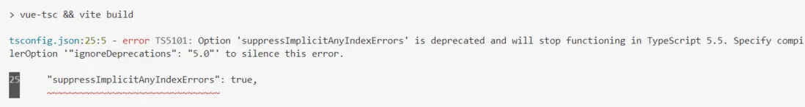

因为类型为 "string" 的表达式不能用于索引类型 "{}"，问题解决方案
使用ts的时候碰到如下问题：

```ts
let str = 'a'
let obj = {
    a: 1
}
obj[str] = 4
```
此时`obj[str]`会有错误提示，**`因为类型为 "string" 的表达式不能用于索引类型 "{}"`**
我知道的解决方案有如下两种：
一、
`obj[str]`改为`obj[str as keyof typeof obj]`
二、
再`tsconfig.json`中添加如下配置：`"suppressImplicitAnyIndexErrors": true`，但是vue项目打包的时候可能会报错如下：

可以在`tsconfig.json`中添加如下配置：
`"ignoreDeprecations": "5.0"`
