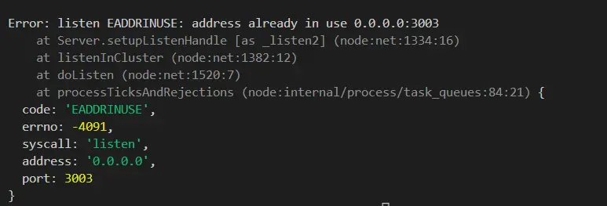
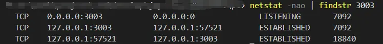

`vscode`启用服务碰到这种情况该怎么解决？
打开`vscode`终端或者命令行，输入
`netstat -nao | findstr 3003`
查找端口占用情况如下：

找到图片中，第一行的`pid`，即`7092`, 终端再输入：
` taskkill /F /pid 7092 `
执行结果如下，就代表进程被杀死了，端口也不会继续占用了。

[参考文章](https://blog.csdn.net/huangwfu/article/details/131599182)
