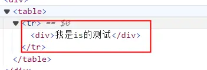

+ 首先`is`我们常在`<component></component>`标签中看到
	` <component :is="demo"></component>`
这种情况就不在多赘述了！
+ 今天发现官网对`is`有这样一个解释
	*用于原生元素* 
原生元素？当时有点懵，这是什么鬼？仔细阅读下去，做了个demo，才理解了。
代码很简单，如下所示：

  ```js
  <template>
    <div>
      <table>
        <tr>
          <td is="vue:demo"></td>
        </tr>
      </table>
    </div>
  </template>
  <script setup>
  const demo = h('div', {
    innerHTML: '我是is的测试'
  })
  </script>
  ```
代码运行之后，去浏览器检查元素就会发现，`td`这个标签没了？？？惊不惊喜？意不意外？


在此奉上[官网地址](https://cn.vuejs.org/api/built-in-special-attributes.html#is)

