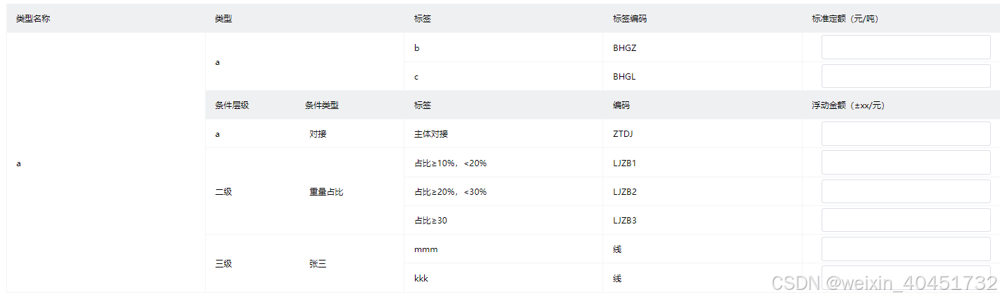

### 问题出现原因
在`router.js`中注册路由：

```javascript
{
    path: '/template-allocation',
    name: 'TemplateAllocation',
    meta: { title: '风险任务详情', keepAlive: true },
    component: () =>
      import(
        '../views/template-allocation/index.vue'
      ),
  },
```
在`router-view`中使用`keepAlive`缓存组件：

```javascript
<router-view v-slot="{ Component }" v-if="isShow">
  <div class="child-view">
    <KeepAlive :include="['TemplateAllocation']">
      <component :is="Component"></component>
    </KeepAlive>
  </div>
</router-view>
```
最后发现并不生效，在大佬的帮助下，才找到原因：
`include`中使用的`name`并不是注册的路由的`name`！！！
而是组件本身的`name`，记得在`vue2`中的时候，`export default`中有个属性可以声明`name`，但是在`vue3`中的`setup`语法糖中，很少关注如何声明`name`。
官网有这么一句话：

可是我自己在整理目录结构的时候，习惯将目录这样设置：`/template-allocation/index.vue`，这样就会导致自动生成的`name`变成了`Index`!
就会导致`keepAlice`的`include`属性不生效了。
### 如何查找我们的组件名称呢?
这就要借助一个常用工具`Vue Devtools`，如下：

从上图可以看到`Index`就是我们的组件名字了。
### `setup`中如何设置组件的名字呢？
官网提供了一个`defineOptions`，可以这么设置：

```javascript
defineOptions({
  name: 'TemplateAllocation'
})
```
从`Vue Devtools`可以看到组件名字变成了``TemplateAllocation``，如下：

以上就是本次的分享内容了，又踩了一个小坑。奉上当初提问的[地址](https://segmentfault.com/q/1010000044968282/a-1020000044968326?_ea=350013249)。