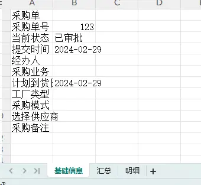
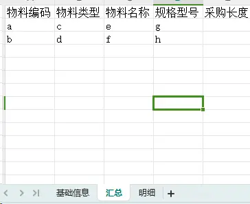

[以前文章](/2021/11/17/sheetJs导出excel%20一/)文章介绍了如何导出单列的excel
本篇文章介绍下多sheet的excel的导出
首先给大家看下效果






从上图可知，基础信息的数据格式和其他两个sheet不一样，所以要单独处理

###  根据现有的数据组装`xlsx`插件所需数据结构
+ 页面数据

*这里以我常用数据为例*


```js
    //基础数据一般是一个普通的对象
    let valueObj = {
        registerNo: '',  //采购单号
        statusName: '',  //状态
        submitDate: '',  //提交时间
        //等等
    }
    //第一个表格数据
    const tableHeader = tableHeader: [
      {
        title: "物料编码",
        map: "materialCode",
      },
      {
        title: "物料类型",
        map: "materialTypeName",
      },
      {
        title: "物料名称",
        map: "materialName",
      },
      {
        title: "规格型号",
        map: "materialModel",
      },
    ]
    const tableData = [
      {
        materialCode: 'a',
        materialTypeName: 'b',
        materialName: 'b',
        materialModel: 'b',
      },
      {
        materialCode: 'a',
        materialTypeName: 'b',
        materialName: 'b',
        materialModel: 'b',
      }
    ]
    //其他的表格数据同上  
    
```


+ 组装数据 


```js
    let data = {
        title: "采购单", //文件名称
        baseSheetName: "基础信息",  
        baseSheetData: [
          {
            label: "采购单号",
            map: "registerNo",
            value: "",
          },
          {
            label: "当前状态",
            map: "registerStatusName",
            value: "",
          },
          //等等
        ], //存放基础数据
        list: [
          {
            sheetName: '汇总', //第一个sheet数据 
            tableHeader: [
              {
                title: "物料编码",
                map: "materialCode",
              },
              {
                title: "物料类型",
                map: "materialTypeName",
              },
              
            ],
            tableData: [
              {
                materialCode: 'a',
                materialTypeName: 'b',
                materialName: 'b',
                materialModel: 'b',
              },
              {
                materialCode: 'a',
                materialTypeName: 'b',
                materialName: 'b',
                materialModel: 'b',
              }
            ]
          },
          {
            sheetName: '明细',
            tableHeader: [  //第二个sheet数据 
              {
                title: "物料编码",
                map: "materialCode",
              },
              {
                title: "物料类型",
                map: "materialTypeName",
              },
              {
                title: "物料名称",
                map: "materialName",
              },
              {
                title: "规格型号",
                map: "materialModel",
              },
              {
                title: "物料说明",
                map: "materialIllustrate",
              },
            ],
            tableData: [
              {
                materialCode: 'a',
                materialTypeName: 'b',
                materialName: 'b',
                materialModel: 'b',
              },
              {
                materialCode: 'a',
                materialTypeName: 'b',
                materialName: 'b',
                materialModel: 'b',
              }
            ]
          }
        ], //其他sheet数据
      }
```

+ 导出函数封装


```js
import * as XLSX from "xlsx/xlsx.mjs"
function exportExcel(data) {
    var wb = XLSX.utils.book_new()
    //处理基础数据
    if (data.baseSheetName) {
        let baseDataArr = []
        data.baseSheetData.map(item => {
          baseDataArr.push({
            [data.title]: item.label,
            '': item.value
          })
        })
        let fdXslxws = XLSX.utils.json_to_sheet(baseDataArr)
        XLSX.utils.book_append_sheet(wb, fdXslxws, data.baseSheetName)
    }
    //处理其他表格数据
    data.list.map((item, index) => {
        let arr = []
        let newHeaderObj = {}
        item.tableHeader.map(item => {
          newHeaderObj[item.map] = item.title
        })
        item.tableData.map((el, idx) => {
          let obj = {}
          for (let x in newHeaderObj) {
            obj[newHeaderObj[x]] = el[x]
          }
          arr.push(obj)
        })
        let fdXslxws = XLSX.utils.json_to_sheet(arr)
        XLSX.utils.book_append_sheet(wb, fdXslxws, item.sheetName)
    })
    XLSX.writeFile(wb, data.title + ".xlsx")
}
```

至此一个简单导出多列sheet的excel功能就完成了。。。
