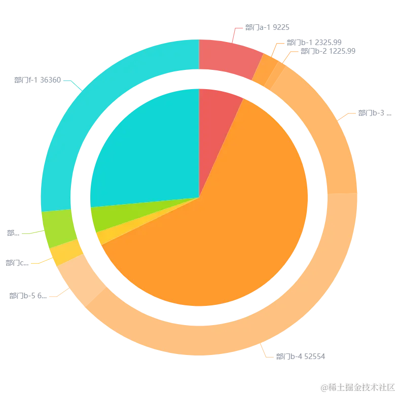

实现饼图+环形图的颜色由父集递减渲染，父子联动。

<!--more -->

[完整效果](https://www.isqqw.com/view/index.html?id=43650&ak=7d7c8161660f4e75a99219be138098eb)

[代码地址](https://www.isqqw.com/viewer?id=43650)

```js
const color = [
   "rgba(237, 94, 89, 1)",
   "rgba(255, 154, 46, 1)",
   "rgba(255, 203, 46, 1)",
   "rgba(159, 219, 29, 1)",
   "rgba(35, 195, 67, 1)",
   "rgba(16, 214, 214, 1)",
   "rgba(60, 151, 255, 1)",
   "rgba(0, 56, 255, 1)",
   "rgba(114, 46, 209, 1)",
   "rgba(228, 34, 228, 1)",
   "rgba(230, 81, 134, 1)",
   "rgba(196, 173, 92, 1)",
   "rgba(94, 126, 188, 1)",
]
let colorMap = {}
let data1 = [
   { "deptId": 57, "name": "部门a", "value": 9225 },
   { "deptId": 58, "name": "部门b", "value": 84005.98 },
   { "deptId": 59, "name": "部门c", "value": 2669 },
   { "deptId": 60, "name": "部门d", "value": 5226 },
   { "deptId": 61, "name": "部门e", "value": 0 },
   { "deptId": 62, "name": "部门f", "value": 36360 }
]
let data2 = [
   { "businessTypeId": 45, "name": "部门a-1", "value": 9225, "deptId": 57 },
   { "businessTypeId": 41, "name": "部门b-1", "value": 2325.99, "deptId": 58 },
   { "businessTypeId": 42, "name": "部门b-2", "value": 1225.99, "deptId": 58 },
   { "businessTypeId": 44, "name": "部门b-3", "value": 21000, "deptId": 58 },
   { "businessTypeId": 59, "name": "部门b-4", "value": 52554, "deptId": 58 },
   { "businessTypeId": 43, "name": "部门b-5", "value": 6900, "deptId": 58 },
   { "businessTypeId": 49, "name": "部门c-1", "value": 2669, "deptId": 59 },
   { "businessTypeId": 46, "name": "部门e-1", "value": 5226, "deptId": 60 },
   { "businessTypeId": 48, "name": "部门f-1", "value": 36360, "deptId": 62 }
]
//计算颜色
function computedChildColor(rgba) {
   // 取第三位 为透明度
   let val = rgba.match(/(\d(\.\d+)?)+/g);
   let cur = val[3];
   cur = (cur - 0.1).toFixed(2);
   let color = `rgba(${val[0]},${val[1]},${val[2]},${cur})`;
   return color;
}
option = {
   tooltip: {
      trigger: "item",
      formatter: "{a} {b}: {c}<span  style='font-size: 12px;color: #8994A3;margin-right: 8px;'>万元</span> ({d}%)",
      borderWidth: 0,
   },
   series: [
      {
         name: "类别",
         type: "pie",
         selectedMode: "single",
         radius: [0, "55%"],
         label: {
            show: false
         },
         labelLine: {
            show: false,
         },
         color: color,
         data: [],
         tooltip: {
            padding: 12,
            borderWidth: 0,
            formatter: function (params) {
               let arr = option.series[1].data.filter(item => item.deptId == params.data.deptId)
               let str = arr.map(item => {
                  let p = (item.value * 100 / total).toFixed(2)
                  p = p.replace(/\.0*$/g, '')
                  return `<li>${item.name}：${item.value}<span style="font-size: 12px;color: #8994A3;margin-right: 8px;">万元</span>(${p}%)</li>`
               }).join('')
               return `
            <div style="color: #4E5766;">
              <p style="margin-bottom: 12px;">${params.name}：${params.value}<span style="font-size: 12px;color: #8994A3;margin-right: 8px;">万元</span>(${params.percent}%)</p>
              <ul>
                ${str}
              </ul>
            </div>
          `
            }
         }
      },
      {
         name: "内容",
         type: "pie",
         radius: ["65%", "80%"],
         labelLine: {
            length: 30,
         },
         label: {
            formatter: "{b} {c}",
            color: "rgb(137, 148, 163)",
            fontSize: 14,
         },
         color: [],
         data: [],
      },
   ],
};
let total = 0
data1.map((item, index) => {
   colorMap[item.deptId] = option.series[0].color[index]
   total += item.value
})
data2.map(item => {
   colorMap[item.deptId] = computedChildColor(colorMap[item.deptId])
   item.itemStyle = {
      color: colorMap[item.deptId]
   }
})
option.series[0].data = data1
option.series[1].data = data2
let idx = []
  myChart.on('mouseover', function (params) {
    if (params.seriesIndex == 0) {
      idx = []
      let deptId = params.data.deptId
      option.series[1].data.map((item, index) => {
        if (item.deptId == deptId) {
          // 高亮当前图形
          idx.push(index)
        }
      })
      myChart.dispatchAction({
        type: 'highlight',
        seriesIndex: 1,
        dataIndex: idx
      });

    }
  });
  myChart.on('mouseout', function (params) {
    myChart.dispatchAction({
      type: 'downplay',
      seriesIndex: 1,
      dataIndex: idx
    });
  });
```
效果如下：




[参考文章](https://blog.csdn.net/xciyi/article/details/112021768)
